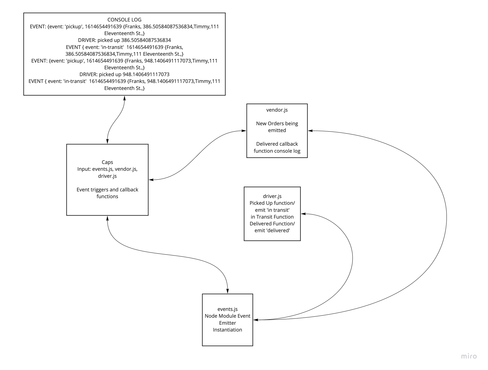
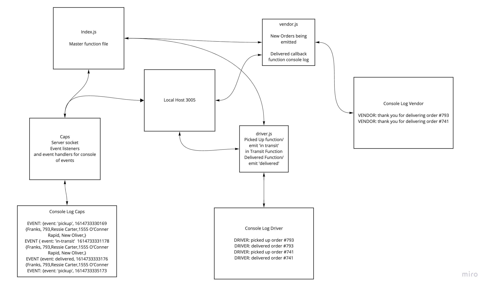
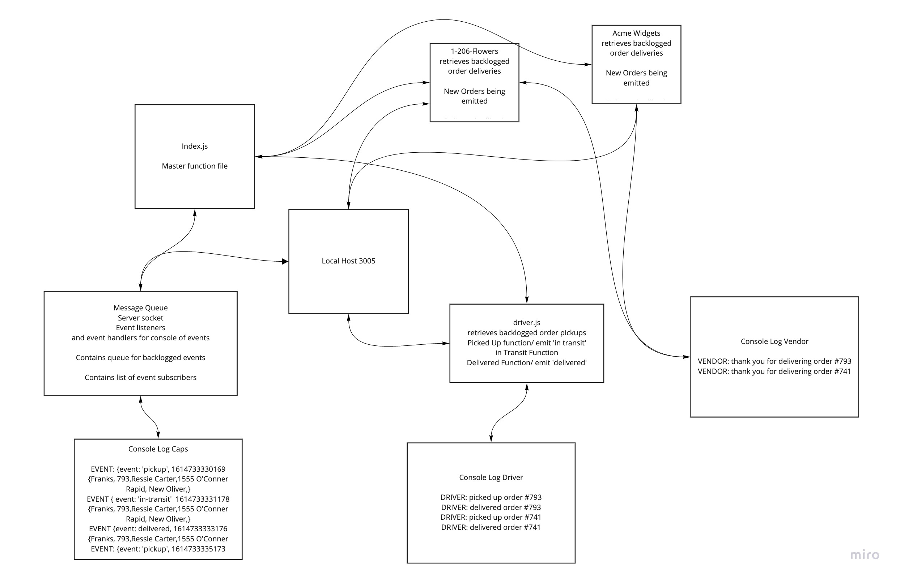

# caps

## Github PR
### Day 1
https://github.com/gerstej9/caps/pull/1
### Day 2
https://github.com/gerstej9/caps/pull/3
## Day 3
https://github.com/gerstej9/caps/pull/5
## Github Actions
https://github.com/gerstej9/caps/actions

## Heroku URLs
https://jamesgersten-caps.herokuapp.com/

## UML
### Day 1

### Day 2

### Day 3

## Class notes
### Day 1
* Learn about Node Event Emitters
* Learn how to set event listeners
* learn how to set event triggers
### Day 2
* Learn about TCP
* Learn about socket.io
* Learn about web sockets
### Day 3
* Learn how to integrate a queue for backlogged events on server
* Learn how to send backlogged events to client upon connection
* Learn how to track client event listeners